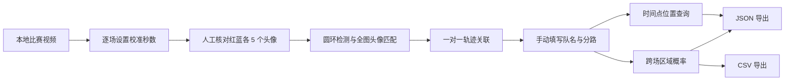

# 战术罗盘（KPL Tactical Compass）

一个面向王者荣耀职业比赛录像的本地空间分析工具。它从回放视频中的小地图提取十名英雄的位置轨迹，允许用户逐场校准头像、填写队伍名称和分路，并按时间点统计“队伍 × 分路”出现在不同地图区域的概率。

> 项目状态：研究原型。当前重点是 KPL 竖屏回放素材和可解释的本地分析流程，不应将识别结果直接视为官方比赛数据。

## 核心能力

- 本地读取单个视频、多个视频路径或整个视频文件夹。
- 每场视频单独填写校准秒数并人工核对十个英雄头像。
- 自动识别蓝、红双方的英雄圆环和头像中心。
- 使用全图头像匹配、圆环检测、局部跟踪和一对一分配提取轨迹。
- 分析结束后逐场填写红蓝双方队名，并设置每个英雄的分路。
- 在独立战术底图上按时间查询英雄位置，不叠加原视频画面。
- 按“队伍 × 分路 × 时间点”统计七类区域的出现概率。
- 导出包含全部轨迹与概率序列的 JSON，以及全时间点概率 CSV。
- 视频和分析中间数据默认只保存在本机，不上传第三方服务。

## 处理流程



## 快速开始

### Windows 一键启动

要求：

- Windows 10/11
- Python 3.10 或更高版本
- 系统可以执行 `py -3` 或 `python`

克隆仓库后双击：

```text
start-local.bat
```

首次启动会在项目目录创建 `.venv` 并安装依赖。程序启动后访问：

<http://127.0.0.1:8765/>

保持命令窗口开启；关闭窗口即可停止服务。

### 手动启动（Windows、macOS、Linux）

```bash
python -m venv .venv
```

激活虚拟环境：

```bash
# Windows PowerShell
.\.venv\Scripts\Activate.ps1

# macOS / Linux
source .venv/bin/activate
```

安装并启动：

```bash
python -m pip install -r requirements-local.txt
python local_app.py
```

如不希望程序自动打开浏览器，可设置：

```bash
KPL_NO_BROWSER=1
```

如希望页面默认显示一个视频路径，可设置：

```bash
KPL_DEFAULT_VIDEO=/absolute/path/to/match.mp4
```

## 使用方法

### 1. 选择视频集

在输入框中填写：

- 一个视频的绝对路径；
- 每行一个视频路径；或
- 包含视频的文件夹路径。

支持的扩展名：

```text
.mp4 .mov .mkv .avi .webm .m4v
```

视频会按路径排序并依次处理。

### 2. 逐场校准

每一场视频都必须独立完成校准：

1. 填写“当前视频校准画面（视频秒）”。
2. 点击“读取第 N 场校准画面”。
3. 确认蓝方和红方各有 5 个标记。
4. 检查每个圆点是否落在英雄头像正中心。
5. 必要时点击标记删除，再点击正确位置补充。
6. 勾选“我已核对本场”并进入下一场。

选择校准时刻时，应优先使用十个头像清晰、分散、没有大面积重叠的画面。这里填写的是视频文件本身的秒数，不是游戏内计时。

游戏时间换算公式：

```text
游戏时间 = 视频秒数 × 回放倍速 + 开局偏移
```

### 3. 设置分析参数

| 参数 | 含义 | 建议 |
| --- | --- | --- |
| 回放倍速 | 视频相对真实比赛时间的倍速 | 与素材一致；测试素材为 4× |
| 开局时间偏移 | 视频起点相对游戏计时的偏移 | 按素材剪辑设置 |
| 对局采样间隔 | 输出轨迹的游戏时间间隔 | 2 秒平衡精度与速度；4 秒更快 |

当前实现主要使用 CPU。以约 300 秒、4× 回放的视频为例：

| 采样间隔 | 约分析帧数 | 约全图头像匹配次数 |
| --- | ---: | ---: |
| 1 秒 | 1200 | 12000 |
| 2 秒 | 600 | 6000 |
| 4 秒 | 300 | 3000 |

批量视频目前按顺序分析，总耗时大致随视频数量线性增长。

### 4. 填写比赛元数据

每场分析完成后需要：

- 输入红蓝双方的真实队伍名称；
- 为十个英雄设置分路：对抗路、打野、中单、发育路、辅助；
- 确保每方五个分路各出现一次。

只有队名与分路配置完整的对局会进入跨场概率统计。

### 5. 查询与导出

- 拖动时间轴：查看当前对局在该时间点的十人位置。
- 查询并统计：刷新所有已配置对局在目标时刻的区域概率。
- 导出数据集 JSON：保存轨迹、队伍、分路、置信度和完整概率序列。
- 导出概率 CSV：保存全部时间点的队伍分路区域概率。

## 区域定义

统计区域包含：

```text
己方红区、己方蓝区、对方红区、对方蓝区、对抗路、中路、发育路
```

分类采用“分路走廊优先，野区方向其次”：

- 中路：蓝方基地到红方基地的反对角线走廊。
- 对抗路：地图上方和左侧的外侧道路走廊。
- 发育路：地图下方和右侧的外侧道路走廊。
- 其余位置按相对地图中心的上、右、下、左方向归入野区。

固定地图方向与双方视角的换算见 [区域规则](docs/REGION_RULES.md)。

## 识别结果与置信度

每个轨迹点包含一个 `source`：

- `global`：全图头像匹配得到的高可信锚点。
- `detected`：英雄圆环候选经一对一关联后得到。
- `template`：局部模板匹配补偿。
- `predicted`：头像不可见时使用短期运动预测。

页面默认不显示置信度低于 50% 的位置；这些点也不进入概率统计分母。头像死亡、离开小地图、严重重叠或被特效遮挡时可能出现“暂未识别”。

## 项目结构

```text
.
├─ local_app.py             # Flask API、OpenCV 检测与轨迹分析
├─ local-ui/
│  ├─ index.html            # 本地应用页面
│  ├─ app.js                # 批量校准、查询、概率统计与导出
│  └─ styles.css            # 本地应用样式
├─ requirements-local.txt   # Python 依赖
├─ start-local.bat          # Windows 启动器
├─ docs/                    # 架构、数据格式、区域规则和故障排查
├─ tests/                   # 自动化检查
├─ app/                     # 可选的 React / vinext Web 交互原型
├─ worker/                  # Web 原型的 Worker 入口
└─ .openai/hosting.json     # 可选 Sites 原型配置
```

`local_app.py + local-ui/` 是当前视频分析主程序。`app/` 是独立的 Web 交互原型，不执行本地视频识别。

## 开发与验证

Python 语法检查：

```bash
python -m py_compile local_app.py
```

前端脚本检查：

```bash
node --check local-ui/app.js
```

可选 Web 原型构建：

```bash
npm ci
npm run build
```

完整的代码路径和设计决策见 [架构说明](docs/ARCHITECTURE.md)。输出字段见 [数据格式](docs/DATA_FORMAT.md)。

## 已知限制

- 小地图裁剪目前针对测试素材的竖屏版式进行了优化；不同赛事包装可能需要调整裁剪。
- 每个视频必须人工确认校准，自动检测不能替代人工核对。
- 英雄头像死亡、重叠、缩放或被遮挡时会降低置信度。
- 当前分析使用 CPU，未启用 GPU 推理。
- 批量任务按顺序执行，刷新页面会中断尚未开始的后续任务。
- 概率反映输入样本集的经验分布，不等同于因果预测或官方战术结论。

## 参与协作

开始贡献前请阅读：

- [贡献指南](CONTRIBUTING.md)
- [架构说明](docs/ARCHITECTURE.md)
- [数据格式](docs/DATA_FORMAT.md)
- [区域规则](docs/REGION_RULES.md)
- [故障排查](docs/TROUBLESHOOTING.md)
- [安全与隐私](SECURITY.md)

建议先通过 GitHub Issue 描述素材版式、复现步骤和预期结果，再提交范围较小、可验证的 Pull Request。

## 隐私与版权

- 仓库不包含比赛视频、用户分析数据或游戏素材。
- `.gitignore` 默认排除常见视频格式、虚拟环境、缓存和分析输出。
- 请只分析和分享你有权使用的录像。
- “王者荣耀”“KPL”及相关标识归其权利人所有。
- 本项目是非官方研究工具，与腾讯、王者荣耀职业联赛及参赛俱乐部不存在隶属或背书关系。

## 许可证

本项目采用 [Apache License 2.0](LICENSE)。提交贡献即表示你同意按照该许可证提供你的贡献。
