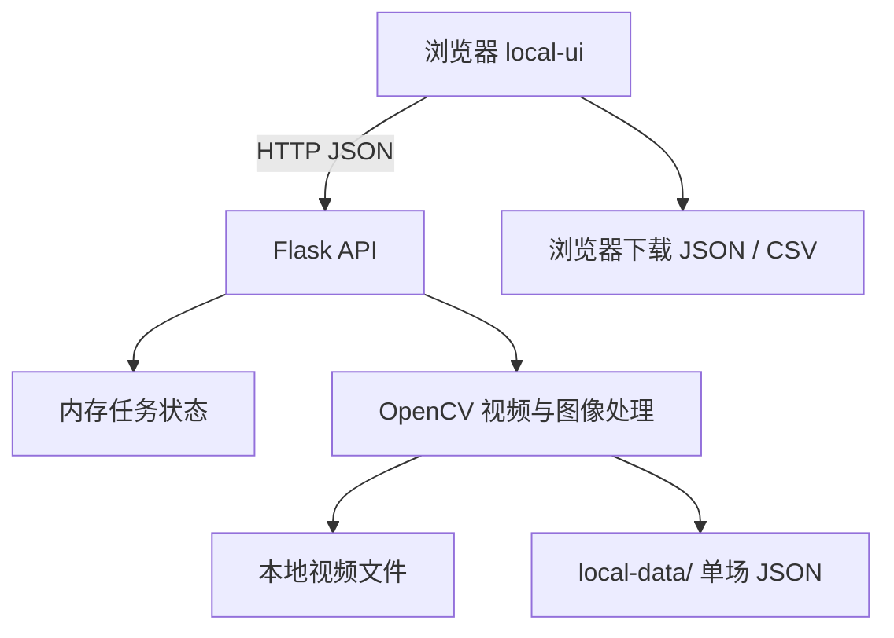

# 架构说明

## 1. 系统边界

战术罗盘由两个相互独立的应用表面组成：

1. **本地视频分析器**：`local_app.py + local-ui/`。这是当前主程序，负责读取本地视频并执行真实轨迹分析。
2. **Web 交互原型**：`app/ + worker/`。用于演示位置查询和预测交互，不读取用户本地视频，也不参与 OpenCV 分析。

本文重点描述本地视频分析器。

## 2. 运行时组件



### 浏览器端

`local-ui/app.js` 负责：

- 解析视频或文件夹路径；
- 管理每场视频的校准状态；
- 按顺序启动分析任务并轮询进度；
- 保存当前页面会话中的队名、英雄名和分路；
- 按时间查询当前比赛位置；
- 跨比赛聚合区域概率；
- 生成数据集 JSON 和概率 CSV。

### Flask API

`local_app.py` 提供以下主要接口：

| 方法 | 路径 | 用途 |
| --- | --- | --- |
| GET | `/` | 返回本地 UI |
| GET | `/assets/<filename>` | 返回静态资源 |
| GET | `/api/defaults` | 返回可选默认视频路径 |
| POST | `/api/resolve-videos` | 将文件或文件夹输入解析为视频列表 |
| POST | `/api/inspect` | 读取指定秒数的校准画面并自动检测头像 |
| POST | `/api/analyze` | 创建单场后台分析任务 |
| GET | `/api/status/<job_id>` | 查询任务进度和最终结果 |
| POST | `/api/frame` | 读取指定视频帧；当前空白底图 UI 不主动调用 |
| GET | `/api/results` | 列出本机最近的单场分析文件 |

任务状态保存在进程内存中；关闭服务后任务状态会丢失，但已经写入 `local-data/` 的单场结果仍保留。

## 3. 校准流程

每场视频都维护独立的：

- 视频路径；
- 校准秒数；
- 地图裁剪区域；
- 十个头像中心；
- 人工确认状态。

前端不允许把上一场的秒数或标记直接用于下一场。用户必须读取当前场的校准画面并确认蓝红双方各 5 个头像。

### 地图裁剪

`default_crop()` 对明显的竖屏视频使用一个基于画面高度的默认裁剪：

- `x = 0`
- `y ≈ height × 0.179`
- 裁剪宽高以原视频宽度为基准

横屏或其他版式默认截取左上方最大正方形。新的赛事包装通常需要新增可配置裁剪或版式检测。

### 初始头像检测

`detect_markers()` 将地图缩放到统一尺寸，并组合：

- 灰度 Hough 圆检测；
- HSV 红蓝圆环颜色评分；
- 头像内部纹理标准差；
- 红方闭合颜色轮廓检测；
- 同队候选去重与置信度排序。

自动检测只负责给出初始建议。人工确认是分析前的必要步骤。

## 4. 逐帧轨迹提取

### 时间换算

```text
video_step = game_sample_seconds / playback_speed
game_second = video_second × playback_speed + game_offset
```

算法从校准帧分别向视频结束和视频开始处理，以便支持校准点之前和之后的完整轨迹。

### 当前跟踪版本

输出字段 `trackingVersion = 3`。

每个采样帧执行：

1. `tracking_candidates()` 检测当前帧中的红蓝英雄圆环候选。
2. 将地图缩小到一半，对十个校准头像分别执行全图模板匹配。
3. 高可信全图匹配成为位置锚点。
4. 未被锚定的轨迹使用预测位置、局部模板和头像外观对候选进行打分。
5. 候选按成本排序，执行一对一贪心分配，避免两名英雄占用同一检测点。
6. 没有可靠候选时依次退化到局部模板或短期运动预测。

### 轨迹来源

| source | 含义 | 典型可信度 |
| --- | --- | --- |
| `global` | 全图头像匹配锚点 | 高 |
| `detected` | 圆环候选经身份关联 | 中高 |
| `template` | 局部模板补偿 | 中低 |
| `predicted` | 基于上一状态的短期预测 | 低 |

前端以 `confidence >= 0.5` 作为默认可见和统计阈值。

## 5. 批量分析

批量流程在浏览器端串行调度：

```text
逐场校准全部完成
  → 启动第 1 场 /api/analyze
  → 轮询完成
  → 启动第 2 场
  → ...
  → 进入元数据配置与概率统计
```

串行执行可以控制 CPU 和内存占用，但总耗时随视频数量线性增长。刷新页面会丢失尚未启动的后续队列。

## 6. 概率聚合

浏览器端以真实队伍名称和分路为分组键：

```text
team_name + role + game_time
```

对每个已完整配置的比赛：

1. 找到目标游戏时间最近的轨迹点；
2. 检查时间差是否在采样容差内；
3. 丢弃置信度低于 50% 的样本；
4. 将坐标分类到七个区域；
5. 以有效比赛数为分母计算概率。

概率是经验频率，不会对缺失样本进行插值，也不会把低可信预测计入分母。

## 7. 性能特征

主要开销：

- 对视频进行大量随机时间定位与解码；
- 每个采样帧的 Hough 圆检测；
- 每帧十次半分辨率全图模板匹配；
- 候选外观直方图与局部模板比较。

复杂度近似与以下乘积成正比：

```text
视频数量 × 视频时长 × 回放倍速 ÷ 游戏采样间隔 × 英雄数量
```

潜在优化方向：

- 使用连续解码代替逐帧 `cap.set` 随机定位；
- 在高可信连续轨迹上降低全图匹配频率；
- 对模板匹配使用更低分辨率的粗到细搜索；
- 将多视频队列持久化到服务端；
- 在保证确定性的前提下并行处理不同视频。

## 8. 失败模式

- **身份交换**：相同队伍头像严重重叠，候选外观不足以区分。
- **静态纹理误检**：地图纹理与头像模板相似。
- **圆环漏检**：技能特效、缩放、压缩和 UI 遮挡改变颜色或轮廓。
- **裁剪错误**：素材版式与默认竖屏裁剪不一致。
- **时间设置错误**：校准秒数对应的画面与实际模板初始化帧不同。
- **死亡状态**：头像不出现在地图中，程序只能输出低可信预测或暂未识别。

处理原则是显式降低置信度，不把缺失信息包装成精确事实。
